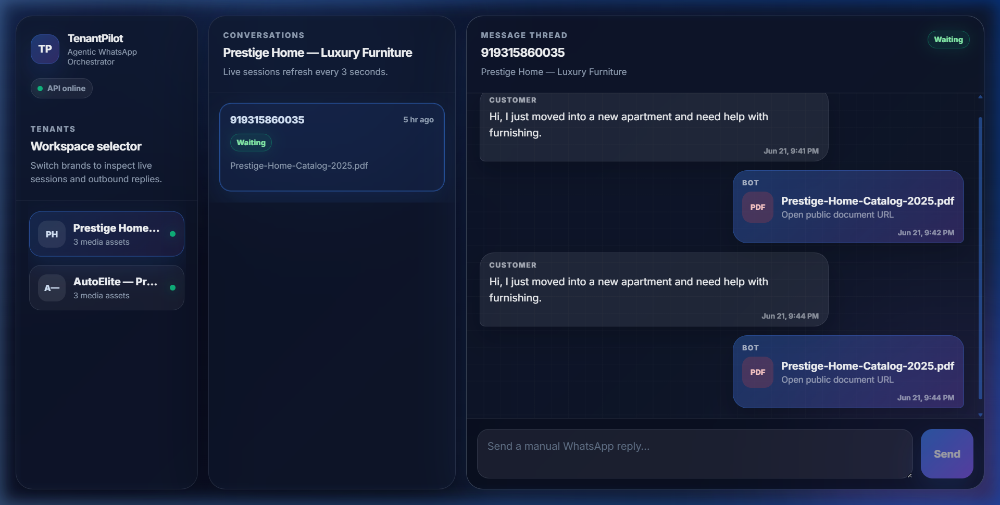
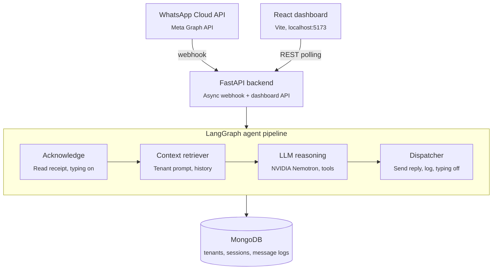
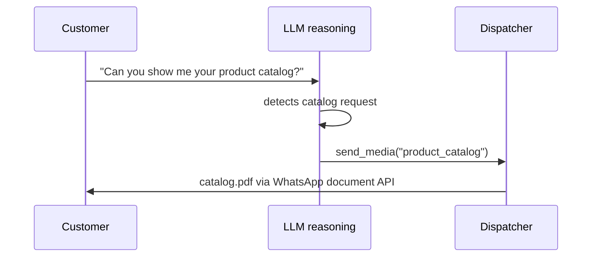

<p align="center">
  
</p>

<h1 align="center">TenantPilot</h1>
<h3 align="center">Multi-Tenant Agentic WhatsApp Orchestrator</h3>

<p align="center">
  <strong>LangGraph-powered AI agent • WhatsApp Cloud API • Multi-tenant SaaS • Real-time Dashboard</strong>
</p>

<p align="center">
  
  
  
  
  
  
  
</p>

---

## Overview

**TenantPilot** is a multi-tenant WhatsApp chatbot orchestrator built for the [Multi-Tenant WhatsApp Agent Assignment](Assignment_%20Multi-Tenant%20WhatsApp%20Agent.pdf). Each tenant (brand/business) gets its own AI-powered WhatsApp bot with:

- **Custom personality** — unique system prompts per tenant
- **Media library** — the AI agent decides when to send product images, catalogs, or documents
- **Conversation history** — full message logs with session tracking
- **Real-time dashboard** — monitor all tenants, sessions, and messages live

### Architecture highlights

| Component       | Technology                              | Purpose                                      |
| --------------- | --------------------------------------- | -------------------------------------------- |
| **Agent brain** | LangGraph (4-node StateGraph)           | Orchestrates the message processing pipeline |
| **LLM**         | NVIDIA Nemotron-3-nano-omni (free tier) | Reasoning + tool-calling for media dispatch  |
| **Backend**     | FastAPI + Beanie/Motor                  | Async REST API with MongoDB ODM              |
| **Frontend**    | React 19 + Vite + TypeScript            | Real-time 3-panel SaaS dashboard             |
| **Messaging**   | WhatsApp Cloud API (mock + real)        | Bi-directional WhatsApp communication        |
| **Database**    | MongoDB (Atlas or local)                | Tenants, sessions, message logs              |
| **Deployment**  | Docker + Docker Compose                 | One-command local setup                      |

---

## System architecture



### LangGraph pipeline (4 nodes)

| Node                  | Responsibility                                                                                             |
| --------------------- | ---------------------------------------------------------------------------------------------------------- |
| **Acknowledge**       | Send read receipt, start typing indicator, upsert session, log inbound message                             |
| **Context retriever** | Load tenant's system prompt, media library, and last 5 chat messages from MongoDB                          |
| **LLM reasoning**     | Invoke NVIDIA Nemotron to decide: reply with text, or call `send_media(key)` to dispatch an image/document |
| **Dispatcher**        | Send the WhatsApp message (text/image/document), turn off typing, log outbound message                     |

---

## Screenshots

<p align="center">
  
  <br />
  <em>Dashboard mid-flight during a live eval — session status and message thread updating in real time</em>
</p>

<table align="center">
  <tr>
    <td align="center" width="50%">
      
      <br />
      <em>Customer message on WhatsApp, testing the frustration-detection path</em>
    </td>
    <td align="center" width="50%">
      
      <br />
      <em>Same conversation on the dashboard, session flagged for human handover</em>
    </td>
  </tr>
</table>

---

## Quick start

### Prerequisites

- **Python 3.11+**
- **Node.js 18+**
- **MongoDB** (local or [MongoDB Atlas](https://www.mongodb.com/cloud/atlas) free tier)
- **NVIDIA API key** (free at [build.nvidia.com](https://build.nvidia.com/))

### 1. Clone & setup

```bash
git clone https://github.com/Sarveshero3/TenantPilot-Multi-Tenant-Agentic-WhatsApp-Orchestrator.git
cd TenantPilot-Multi-Tenant-Agentic-WhatsApp-Orchestrator

# Copy environment config
cp .env.example .env
# Edit .env with your MongoDB URI and NVIDIA API key
```

### 2. Backend

```bash
cd backend
pip install -r requirements.txt

# Start the server
uvicorn app.main:app --reload --port 8000

# In another terminal — seed demo tenants
python -m scripts.seed_tenants
```

### 3. Frontend

```bash
cd frontend
npm install
npm run dev
# Open http://localhost:5173
```

### 4. Verify

- **Backend health:** http://localhost:8000/health
- **Swagger docs:** http://localhost:8000/docs
- **Dashboard:** http://localhost:5173

---

## Docker (one-command setup)

```bash
# Copy .env and fill in your keys
cp .env.example .env

# Start everything (MongoDB + Backend + Frontend)
docker compose up -d

# Seed demo tenants
docker compose exec backend python -m scripts.seed_tenants

# Open the dashboard
open http://localhost:5173
```

---

## API reference

| Method | Endpoint                      | Description                                    |
| ------ | ----------------------------- | ---------------------------------------------- |
| `GET`  | `/health`                     | Liveness probe                                 |
| `GET`  | `/api/webhook`                | Meta webhook verification (`hub.verify_token`) |
| `POST` | `/api/webhook`                | Receive inbound WhatsApp messages              |
| `GET`  | `/api/tenants`                | List all registered tenants                    |
| `GET`  | `/api/tenants/{tenant_id}`    | Get a single tenant's config                   |
| `GET`  | `/api/sessions?tenant_id=xxx` | List chat sessions (filterable)                |
| `GET`  | `/api/sessions/{id}/messages` | Get full message history                       |
| `POST` | `/api/broadcast`              | Send a manual message to a customer            |

Full interactive docs available at `/docs` (Swagger UI) and `/redoc` (ReDoc).

---

## Multi-tenancy

Each tenant is a separate business/brand with its own:

```python
{
    "tenant_id": "luxury-furniture",           # Unique slug
    "name": "Luxury Furniture Co.",            # Display name
    "whatsapp_phone_number_id": "1234567890",  # Meta phone number
    "system_prompt": "You are a luxury furniture sales assistant...",
    "media_library": {
        "product_catalog": {
            "url": "https://example.com/catalog.pdf",
            "media_type": "document",
            "filename": "LuxuryFurniture_Catalog.pdf",
            "description": "Full product catalog with prices"
        },
        "showroom_photo": {
            "url": "https://example.com/showroom.jpg",
            "media_type": "image",
            "description": "Photo of the flagship showroom"
        }
    }
}
```

The LLM agent uses the `system_prompt` as its personality and the `media_library` as tools it can invoke when relevant to the conversation.

---

## Agentic decision-making

The LLM doesn't just reply with text — it **decides** the response type:

1. **Text reply:** Standard conversational response
2. **Media dispatch:** When the customer asks about products, catalogs, or visual content, the LLM invokes `send_media(key)` to dispatch the appropriate media asset from the tenant's library



This is powered by [LangGraph](https://langchain-ai.github.io/langgraph/) with NVIDIA's free-tier Nemotron model.

---

## Project structure

```
TenantPilot/
├── backend/
│   ├── app/
│   │   ├── main.py                    # FastAPI entry point
│   │   ├── config.py                  # Centralized settings (pydantic-settings)
│   │   ├── db.py                      # MongoDB/Beanie connection
│   │   ├── api/
│   │   │   ├── webhook.py             # WhatsApp webhook handler
│   │   │   └── dashboard.py           # REST API for frontend
│   │   ├── agent/
│   │   │   ├── state.py               # AgentState TypedDict
│   │   │   ├── graph.py               # LangGraph StateGraph builder
│   │   │   └── nodes/
│   │   │       ├── acknowledge.py     # Node 1: Read receipt + session
│   │   │       ├── context_retriever.py  # Node 2: Tenant + history
│   │   │       ├── llm_reasoning.py   # Node 3: NVIDIA LLM + tools
│   │   │       └── dispatcher.py      # Node 4: WhatsApp send
│   │   ├── models/
│   │   │   ├── tenant.py              # Tenant Beanie document
│   │   │   ├── chat_session.py        # ChatSession document
│   │   │   └── message_log.py         # MessageLog document
│   │   └── whatsapp/
│   │       ├── client_interface.py    # Protocol + payload builder
│   │       ├── mock_client.py         # Mock (logs JSON payloads)
│   │       └── real_client.py         # Real (Meta Graph API)
│   ├── scripts/
│   │   ├── seed_tenants.py            # Seed demo tenants
│   │   ├── test_imports.py            # Model import smoke test
│   │   ├── test_agent_graph.py        # Agent pipeline smoke test
│   │   └── test_api_routes.py         # API route verification
│   └── requirements.txt
├── frontend/
│   ├── src/
│   │   ├── App.tsx                    # 3-panel dashboard layout
│   │   ├── api/client.ts              # Typed fetch wrapper
│   │   ├── types/index.ts             # TypeScript interfaces
│   │   └── components/
│   │       ├── TenantSidebar.tsx       # Tenant selector
│   │       ├── SessionList.tsx         # Session list + status badges
│   │       ├── MessageThread.tsx       # Chat bubbles + media
│   │       ├── BroadcastInput.tsx      # Reply input
│   │       ├── StatusBadge.tsx         # Color-coded status
│   │       └── TypingIndicator.tsx     # Animated typing dots
│   ├── package.json
│   └── vite.config.ts
├── Dockerfile                         # Multi-stage (Node + Python)
├── docker-compose.yml                 # Local dev (Mongo + Backend + Frontend)
├── .env.example                       # Environment template
└── docs/
    ├── dashboard-test1-live.png       # Dashboard mid-eval screenshot
    ├── Human Frustration Whatsapp.png # WhatsApp side of handover test
    └── Human Frustration Frontend.png # Dashboard side of handover test
```

---

## Environment variables

| Variable                   | Default                                         | Description                                                     |
| -------------------------- | ----------------------------------------------- | --------------------------------------------------------------- |
| `MONGODB_URI`              | `mongodb://localhost:27017`                     | MongoDB connection string                                       |
| `MONGODB_DB_NAME`          | `tenantpilot`                                   | Database name                                                   |
| `WHATSAPP_MODE`            | `mock`                                          | `mock` logs payloads, `real` sends to Meta API                  |
| `WHATSAPP_ACCESS_TOKEN`    | —                                               | Meta Graph API bearer token                                     |
| `WHATSAPP_PHONE_NUMBER_ID` | —                                               | Default Meta phone number ID                                    |
| `WHATSAPP_VERIFY_TOKEN`    | —                                               | Webhook verification secret                                     |
| `NVIDIA_API_KEY`           | —                                               | NVIDIA AI Endpoints API key ([free](https://build.nvidia.com/)) |
| `LLM_MODEL`                | `nvidia/nemotron-3-nano-omni-30b-a3b-reasoning` | LLM model name                                                  |
| `APP_ENV`                  | `development`                                   | Environment tag                                                 |
| `FRONTEND_URL`             | `http://localhost:5173`                         | CORS origin                                                     |

---

## Testing

```bash
cd backend

# Smoke tests (no MongoDB or LLM needed)
python scripts/test_imports.py       # Model + config imports
python scripts/test_agent_graph.py   # LangGraph pipeline topology
python scripts/test_api_routes.py    # OpenAPI schema verification
```

Live evals (real WhatsApp send/receive, real dashboard updates) are logged in [`evals.md`](evals.md).

---

## Tech stack

| Layer               | Technology                                    | Why                                                 |
| ------------------- | --------------------------------------------- | --------------------------------------------------- |
| **LLM**             | NVIDIA Nemotron-3-nano-omni-30b-a3b-reasoning | Free tier, multimodal, reasoning-enabled            |
| **Agent framework** | LangGraph                                     | Explicit graph-based orchestration with typed state |
| **Backend**         | FastAPI + Beanie + Motor                      | Async-first, Pydantic validation, MongoDB ODM       |
| **Frontend**        | React 19 + Vite + TypeScript                  | Fast dev, type-safe, modern tooling                 |
| **Database**        | MongoDB                                       | Flexible schema for tenant configs + message logs   |
| **Messaging**       | WhatsApp Cloud API                            | Global reach, media support (text/image/document)   |
| **Deployment**      | Docker + Docker Compose                       | Reproducible environments                           |

---

## Assignment mapping

| Assignment task                   | Implementation                                                                 |
| --------------------------------- | ------------------------------------------------------------------------------ |
| **Task 1:** MongoDB schema design | `backend/app/models/` — Tenant, ChatSession, MessageLog (Beanie documents)     |
| **Task 2:** WhatsApp Cloud API    | `backend/app/whatsapp/` — Protocol interface + mock + real clients             |
| **Task 3:** LangGraph agent       | `backend/app/agent/` — 4-node pipeline: acknowledge → context → LLM → dispatch |
| **Task 4:** Async webhook handler | `backend/app/api/webhook.py` — GET verify + POST with BackgroundTasks          |
| **Task 5:** React dashboard       | `frontend/` — 3-panel layout, polling, broadcast, status badges                |
| **Task 6:** Docker deployment     | `Dockerfile` + `docker-compose.yml` — multi-stage build, 3-service compose     |

---

## Known limitations

- WhatsApp Cloud API integration was developed and validated end-to-end in `real` mode against a Meta sandbox test number; the bearer token used during development is a temporary 24-hour token, not a permanent system-user token.
- Frontend deployment target (GCP Cloud Run vs. Firebase Hosting vs. alternative) was deliberately left undecided pending further evaluation — see `handover.md` for current status.
- Full eval suite covers the core text, image, and document dispatch paths plus the frustration-handover path; see `evals.md` for the complete pass/fail log.

---

## Security notes

- API keys are loaded from `.env` via `pydantic-settings` — never hardcoded
- CORS is restricted to the configured frontend URL
- Webhook verification uses a shared secret (configurable via `WHATSAPP_VERIFY_TOKEN`)
- WhatsApp `mock` mode is the default — no real messages sent without explicit configuration

---

## License

This project is licensed under the [AGPL-3.0 License](LICENSE).

---

<p align="center">
  Built with LangGraph, FastAPI, React, and NVIDIA AI
</p>
